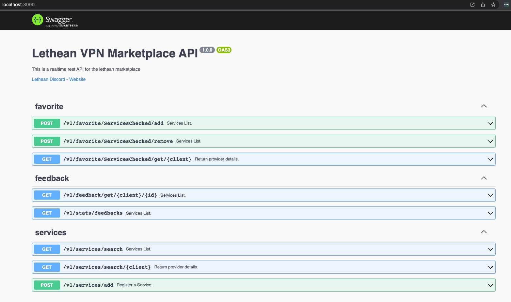

# sdp

Please dont run this on a live server for now.

## Local build

```text
npm install
```

```text
npm start
```

http://localhost:3000



## Docker

Docker Hub: https://hub.docker.com/r/lthn/sdp

`docker run --detach --name lethean-sdp --expose 3000 --hostname "${HOSTNAME}" lthn/sdp `

- `$ docker exec -it lethean-sdp pm2 monit` 	    Monitoring CPU/Usage of each process
- `$ docker exec -it lethean-sdp pm2 list`	        Listing managed processes
- `$ docker exec -it lethean-sdp pm2 show`	        Get more information about a process
- `$ docker exec -it lethean-sdp pm2 reload all`	0sec downtime reload all applications

```dockerfile
version: '3.8'
services:
  dynamodb-local:
    command: "-jar DynamoDBLocal.jar -sharedDb -dbPath ./data"
    image: "amazon/dynamodb-local:latest"
    container_name: dynamodb-local
    ports:
      - "8000:8000"
    volumes:
      - "./docker/dynamodb:/home/dynamodblocal/data"
    working_dir: /home/dynamodblocal
  sdp-server:
    image: lthn/sdp
    build:
      context: .
    container_name: lethean-sdp
    environment:
      - IS_OFFLINE=true
    ports:
      - "8080:3000"


```
